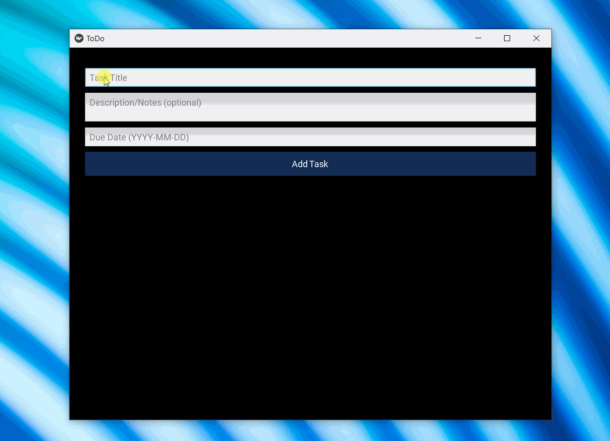
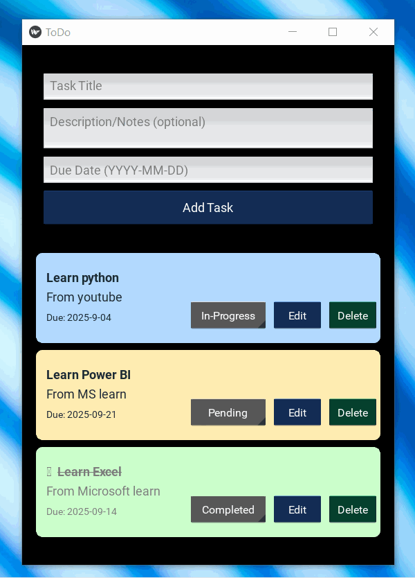

# ✅ To-Do List App (Responsive | Built with Kivy + GitHub Copilot + GPT-4.1)


Ever stared at a mountain of tasks and thought, *“I’ll do it later”*?  
Well, this app is here to make sure “later” finally becomes **now**. 🚀  

A sleek, Python-powered **To-Do List** app built with [Kivy](https://kivy.org/), trained under the guiding wisdom of GitHub Copilot and GPT-4.1.  
Yes, it’s human + AI teamwork at its finest.  

---
## 🎥 Preview in Action
Here’s a sneak peek of the app in motion:  





---
## ✨ What You Can Do

### From `todo_app.py`
- ➕ Add tasks with **title, description, and due date**  
- ✏️ Edit tasks anytime (because plans change, right?)  
- ❌ Delete tasks you don’t care about anymore  
- 🔄 Track status: **Pending → In-Progress → Completed**  
- ⏰ Overdue tasks scream for attention with visual highlights  
- 📌 Tasks auto-sort: **In-Progress on top, Completed at the bottom** 
- 🎨 Clean, responsive UI with padding, colors, and nice button layout  
- 🚨 Smart alerts for invalid dates.   
- 💾 Save tasks to a **JSON file** (persistence FTW)  
- 📂 Load your to-do list instantly when the app starts  
- ✍️ Add, update, and delete tasks seamlessly  
- 📦 Portable storage: everything stays in the app directory  


---


## 🖥️ Why This App?
Because sticky notes get lost.  
Because “mental notes” get forgotten.  
Because productivity deserves a UI that actually **looks good**.  

---

## 🚀 Getting Started
```bash
# Clone this repo
git clone https://github.com/akshay-avak/To-do-list-with-Github-copilot-and-GPT-4.1.git

# Go inside the project
cd To-do-list-with-Github-copilot-and-GPT-4.1

# Install dependencies
pip install -r requirements.txt

# Run the app
python todo_app.py
```
- 🤖 Made With

- 🐍 Python + Kivy

- 💡 GitHub Copilot

- 🧠 GPT-4.1

- ✅ Final Words.Even this README.md is made with GitHub copilot and GPT-4.1

This app isn’t just about tasks. It’s about turning chaos into clarity.
Try it out. Mark things done. Feel awesome.

## 🎥 More Previews
More sneak peeks of the app in motion:  


